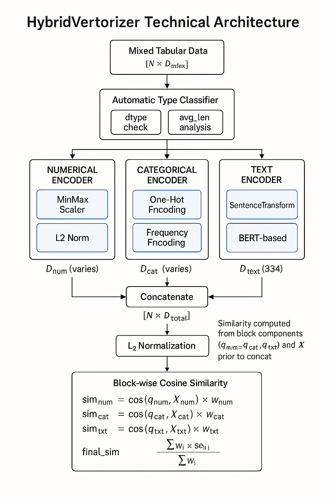

# HybridVectorizer

**Unified embedding for tabular, text, and multimodal data with powerful similarity search.**

HybridVectorizer automatically handles mixed data types (numerical, categorical, text, dates) and creates high-quality vector representations for similarity search, recommendation systems, and machine learning pipelines.

# Quick Start

## Basic Usage

```python
import pandas as pd
from hybrid_vectorizer import HybridVectorizer

# Load financial data (S&P 500 companies)
df = pd.read_csv("sp500_companies.csv")

# Select relevant columns for analysis
df = df[['Symbol', 'Sector', 'Industry', 'Currentprice', 'Marketcap', 
         'Fulltimeemployees', 'Longbusinesssummary']]

# Initialize with company symbol as index
hv = HybridVectorizer(index_column="Symbol")
vectors = hv.fit_transform(df)

print(f"Generated {vectors.shape[0]} vectors with {vectors.shape[1]} features")
```

## Finding Similar Companies

```python
# Find companies similar to Google (GOOGL)
query = df.loc[df['Symbol']=='GOOGL'].iloc[0].to_dict()

results = hv.similarity_search(query, ignore_exact_matches=True, top_n=5)
print(results[['Symbol', 'Sector', 'Marketcap', 'similarity']])
```

## Weight Tuning for Different Use Cases

### Focus on Business Description (Text Similarity)
```python
# Emphasize business model similarity
results = hv.similarity_search(
    query,
    block_weights={'text': 2.0, 'numerical': 0.5, 'categorical': 0.5},
    top_n=5
)
print("Companies with similar business models:")
print(results[['Symbol', 'Sector', 'Longbusinesssummary', 'similarity']])
```

### Focus on Financial Metrics
```python
# Emphasize financial similarity
results = hv.similarity_search(
    query,
    block_weights={'text': 0.3, 'numerical': 2.0, 'categorical': 0.5},
    top_n=5
)
print("Companies with similar financials:")
print(results[['Symbol', 'Currentprice', 'Marketcap', 'similarity']])
```

### Focus on Industry/Sector
```python
# Emphasize sector/industry similarity
results = hv.similarity_search(
    query,
    block_weights={'text': 0.3, 'numerical': 0.5, 'categorical': 2.0},
    top_n=5
)
print("Companies in similar sectors:")
print(results[['Symbol', 'Sector', 'Industry', 'similarity']])
```

## Custom Queries

```python
# Search for specific characteristics
custom_query = {
    'Sector': 'Technology',
    'Longbusinesssummary': 'cloud computing artificial intelligence',
    'Marketcap': 500000000000,  # $500B market cap
    'Fulltimeemployees': 100000
}

results = hv.similarity_search(custom_query, top_n=5)
print("Large tech companies with AI/cloud focus:")
print(results[['Symbol', 'Sector', 'Marketcap', 'similarity']])
```

## Real-World Use Cases

- **Investment Research**: Find companies with similar business models or financials
- **Competitor Analysis**: Identify direct and indirect competitors  
- **Portfolio Construction**: Build diversified portfolios based on similarity
- **Market Research**: Understand sector clustering and relationships

## 📦 Installation

```bash
pip install hybrid-vectorizer
```

## GPU Support (Recommended for Better Performance)

For faster text embedding with large datasets, install GPU-accelerated PyTorch:

### Check Your CUDA Version
```bash
nvidia-smi
```
Look for "CUDA Version: X.X" in the output.

### Install GPU Support
```bash
# For CUDA 11.8 (most common)
pip install hybrid-vectorizer
pip install torch --index-url https://download.pytorch.org/whl/cu118

# For CUDA 12.1
pip install torch --index-url https://download.pytorch.org/whl/cu121
```

### Verify GPU Installation
```python
import torch
from hybrid_vectorizer import HybridVectorizer

print(f"CUDA available: {torch.cuda.is_available()}")
if torch.cuda.is_available():
    print(f"GPU: {torch.cuda.get_device_name()}")

# Test with your data
hv = HybridVectorizer()
# Should show "GPU detected" instead of "Using CPU"
```

### Performance Notes
- **CPU**: Works well for datasets <1000 rows
- **GPU**: 5-10x faster for text embedding, recommended for larger datasets
- Text columns benefit most from GPU acceleration

**Requirements:**
- Python 3.8+
- pandas, numpy, scikit-learn
- sentence-transformers, torch

## 🏗️ Architecture

HybridVectorizer uses a novel late fusion approach for multimodal similarity search:


## ✨ Key Features

### 🔄 **Automatic Data Type Handling**
- **Numerical**: Auto-normalized with MinMaxScaler
- **Categorical**: One-hot or frequency encoding (smart threshold)
- **Text**: SentenceTransformer embeddings
- **Dates**: Extract features or ignore
- **Mixed**: Handles missing values, inf, NaN gracefully

### 🎯 **Powerful Similarity Search**
- **Late Fusion**: Combines modalities with configurable weights
- **Block-level Control**: Weight text vs. numerical vs. categorical separately
- **Explanation**: See which features drive similarity

### 🛠️ **Production Ready**
- **Memory Efficient**: Optimized for large datasets
- **GPU Support**: Automatic GPU detection for text encoding
- **Persistence**: Save/load trained models
- **Error Handling**: Informative custom exceptions

## 💡 Usage Examples

### Basic Usage
```python
# Fit and transform
hv = HybridVectorizer()
vectors = hv.fit_transform(df)

# Simple query
results = hv.similarity_search({'description': 'machine learning'})
```

### Advanced Configuration
```python
hv = HybridVectorizer(
    column_encodings={'description': 'text', 'category': 'categorical'},
    ignore_columns=['id', 'created_at'],
    index_column='id',
    onehot_threshold=15,
    text_batch_size=64
)
```

### Weighted Search
```python
# Emphasize text over numerical features
results = hv.similarity_search(
    query,
    block_weights={'text': 3, 'categorical': 2, 'numerical': 1}
)
```

### Text-Only Search
```python
results = hv.similarity_search(
    {'description': 'AI startup'}
)
```

## 🔧 Configuration Options

| Parameter | Description | Default |
|-----------|-------------|---------|
| `column_encodings` | Manual type overrides | `{}` |
| `ignore_columns` | Skip these columns | `[]` |
| `index_column` | ID column (preserved in results) | `None` |
| `onehot_threshold` | Max categories for one-hot encoding | `10` |
| `default_text_model` | SentenceTransformer model | `'all-MiniLM-L6-v2'` |
| `text_batch_size` | Batch size for text encoding | `128` |

## 📊 Data Type Detection

HybridVectorizer automatically detects:

- **Numerical**: `int64`, `float64`, etc. → MinMax normalization
- **Categorical**: `object` with ≤10 unique values → One-hot encoding
- **Text**: `object` with >10 unique values → SentenceTransformer embeddings
- **Dates**: `datetime64` → Extract year/month/day or ignore

Override with `column_encodings={'col': 'text'}` if needed.

## 🎛️ Advanced Features

### Model Persistence
```python
# Save trained model
hv.save('my_vectorizer.pkl')

# Load later
hv2 = HybridVectorizer.load('my_vectorizer.pkl')
results = hv2.similarity_search(query)
```

### Encoding Report
```python
# See how each column was processed
report = hv.get_encoding_report()
print(report)
```

### External Vector Database
```python
import faiss

# Use FAISS for faster search
index = faiss.IndexFlatIP(vectors.shape[1])
index.add(vectors)
hv.set_vector_db(index)
```

## 🚨 Error Handling

```python
from hybrid_vectorizer import HybridVectorizerError, ModelNotFittedError

try:
    results = hv.similarity_search(query)
except ModelNotFittedError:
    print("Call fit_transform() first!")
except HybridVectorizerError as e:
    print(f"HybridVectorizer error: {e}")
```

## 📈 Performance

Typical performance on modern hardware:

| Dataset Size | Fit Time | Search Time | Memory |
|--------------|----------|-------------|--------|
| 1K rows | <1s | <1ms | ~50MB |
| 10K rows | <10s | <10ms | ~200MB |
| 100K rows | <2min | <100ms | ~1GB |

*With mixed data types including text columns*

## 🛠️ Development

```bash
# Clone repository
git clone https://github.com/hariharaprabhu/hybrid-vectorizer
cd hybrid-vectorizer

# Install in development mode
pip install -e .

# Run tests
python tests/test_basic.py
```

## 📄 License

Apache-2.0 License - see LICENSE file for details.

## 📞 Support

- **Issues**: [GitHub Issues](https://github.com/hariharaprabhu/hybrid-vectorizer/issues)
- **Documentation**: See this README and docstrings
- **Questions**: Open an issue for questions or feature requests

---

**HybridVectorizer** - Making multimodal similarity search simple and powerful. 🚀